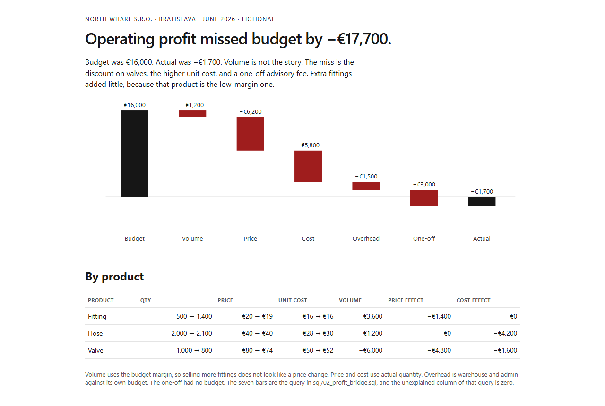

# Profit bridge

[](https://github.com/LiKeT128/profit-bridge/actions/workflows/build.yml) · **[Live pack →](https://liket128.github.io/profit-bridge/)**

A one-page management pack for a fictional Bratislava wholesaler, North Wharf. June operating profit missed the budget. The page says why, in euros, and the pieces add back to the miss.

Budget profit was €16,000. Actual was −€1,700. The gap is −€17,700.

| Driver | Effect on profit |
| --- | ---: |
| Volume | −€1,200 |
| Price | −€6,200 |
| Unit cost | −€5,800 |
| Overhead | −€1,500 |
| One-off advisory | −€3,000 |

Volume is the small line. More fittings were sold, and those units carry a thin budget margin. Fewer valves were sold, and valves are the high-margin product. Those two moves almost cancel.



## Run

```powershell
python build_pack.py
```

Open `pack/index.html`. Python 3.11+ and the standard library. No packages.

## The formula

For each product, in `schema.sql`:

- Volume = (actual qty − budget qty) × budget margin
- Price = (actual price − budget price) × actual qty
- Cost = (budget unit cost − actual unit cost) × actual qty

A higher unit cost is a negative cost effect. The three lines sum to actual contribution minus budget contribution. `sql/01_sku_bridge.sql` checks that product by product. `sql/02_profit_bridge.sql` adds overhead and the one-off, and checks that the whole bridge lands on actual operating profit. The unexplained column is zero.

Overhead is warehouse and admin: budget €40,000, actual €41,500. The advisory fee had no budget, so the whole €3,000 is a variance.

## Data

Three products: Valve, Hose, Fitting. One month. Figures are written into the database as integers, not scraped. The company is not real.

## What this does not do

It does not forecast the next month, and it does not split volume into a pure volume effect and a mix effect. Mix sits inside the volume line, because each extra unit is valued at its own budget margin. A separate mix line would need a second identity, and this pack does not pretend to have one.
